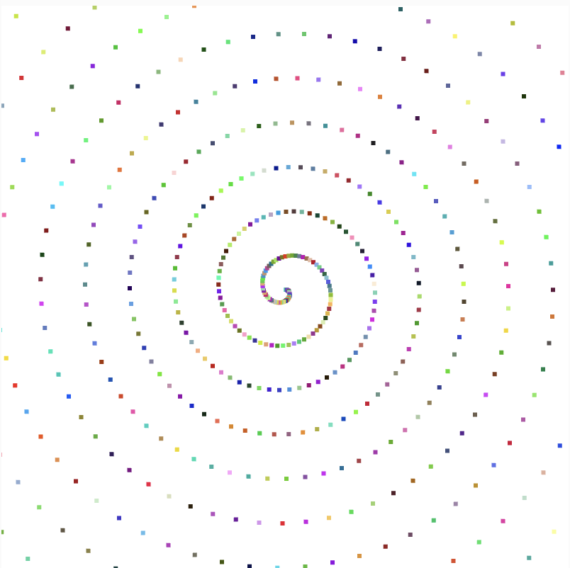
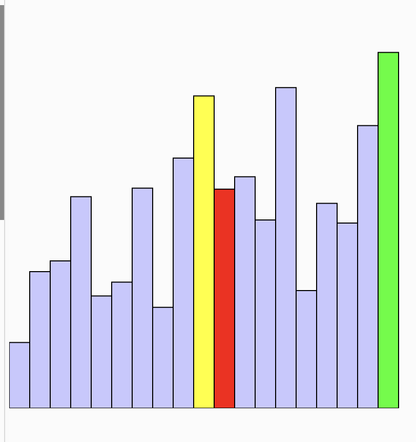
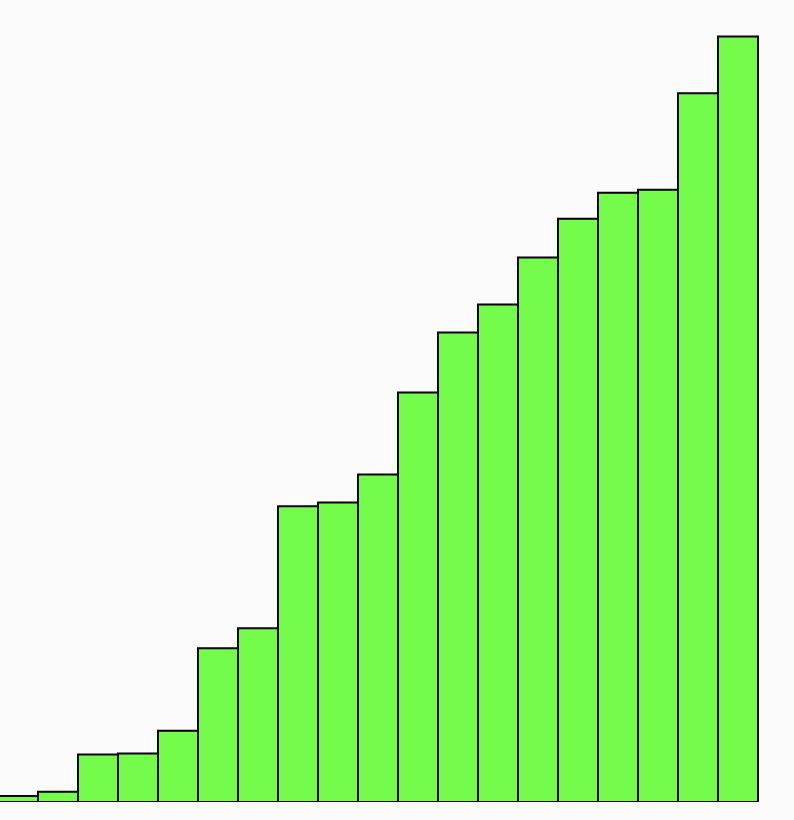
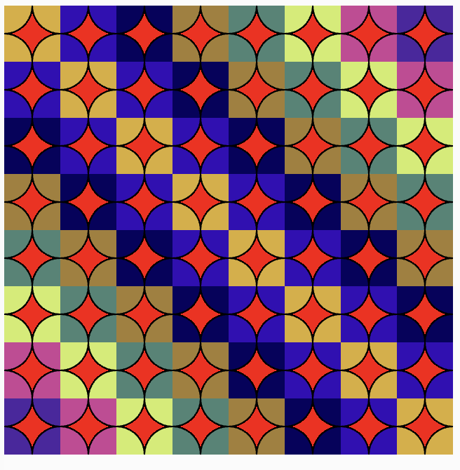

# Generatywne wzory i algorytmy

## 1. Spirala z losowymi kolorami

Wykorzystując metody translate, cos i sin oraz random, stwórz algorytm, który wygeneruje spiralę
przedstawioną na obrazku powyżej. 

https://editor.p5js.org/DBulinski/sketches/AM3P-Nzfz

## 2. Bubble sort

1. Stwórz nowy sketch
2. Wewnątrz niego zaimplementuj algorytm sortowania bąbelkowego
3. Wykorzystaj metody z p5js do wygenerowania wizualizacji sortowania
4. Elementy już posortowane powinny być zielone, a te, które są obecnie porównywane - czerwone i żółte

https://editor.p5js.org/DBulinski/sketches/ks2zdWEPZ

## 3. Wzór z kół

1. Stwórz nowy sketch
2. Zaimplementuj algorytm generujący wzór z kół przedstawiony na obrazku powyżej
3. Zauważ, że kolory są takie same dla każdej przekątnej canvasa (kolor jest taki sam dla komórek o współrzędnych ABS(x - y) = const)
4. Wielkość canvasa powinna być regulowana za pomocą zmiennej TILES_COUNT
5. * Dodatkowe: zaimplementuj kontroler, do zmiany ilości kół na canvasie i wielkości płytki

https://editor.p5js.org/DBulinski/sketches/hDejuXCyM

